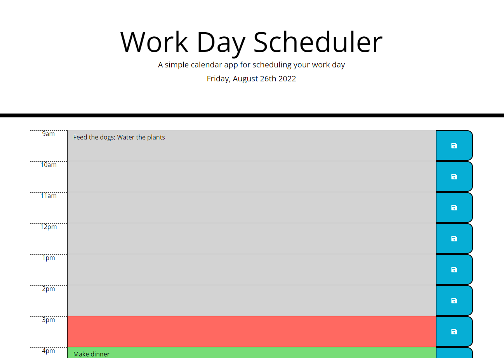

# Work Day Scheduler

## Description
This webpage is work day scheduler that not only visually keeps track of the current hour, but also save your event and/or tasks information.

## Usage

This webpage is useful for organizing tasks or events throughout a day. The work scheduler is color coded to track the current hour as the color red. The hours past are denoted with a gray color, while the future tasks are color coded to green. The blue button with the save icon can be used to save information for future reference.

## Links

[Work Day Scheduler webpage](https://mladame.github.io/work-day-scheduler/)

[Github Repo/work-day-scheuler](https://github.com/mladame/work-day-scheduler)